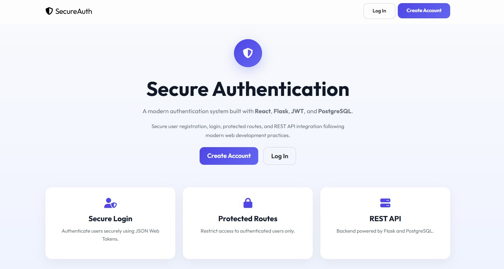

# SecureAuth

[](https://react.dev/)
[](https://www.python.org/)
[](https://flask.palletsprojects.com/)
[](https://jwt.io/)
[](https://www.postgresql.org/)

A full-stack authentication application built with **React**, **Flask**, and **PostgreSQL** that implements secure user authentication using **JSON Web Tokens (JWT)**.

SecureAuth demonstrates user registration, secure login, protected routes, REST API integration, and frontend-backend communication while following modern web development practices.

---

## Preview



> Secure authentication flow including user registration, login, JWT validation, and protected routes.

---

## Features

- User registration
- Secure login
- Protected routes
- JWT-based authentication
- Session management
- Secure logout
- REST API integration
- Responsive user interface

---

## Tech Stack

### Frontend

- React
- JavaScript (ES6+)
- Vite
- CSS3

### Backend

- Python
- Flask
- Flask-JWT-Extended
- SQLAlchemy

### Database

- PostgreSQL

### Tools

- Git
- GitHub

---

## Project Structure

```text
src/
│
├── api/                  # Flask backend
│   ├── models.py
│   ├── routes.py
│   └── utils.py
│
├── front/                # React frontend
│   ├── assets/
│   ├── components/
│   ├── hooks/
│   ├── pages/
│   ├── index.css
│   ├── main.jsx
│   ├── routes.jsx
│   └── store.js
│
├── app.py
└── wsgi.py

docs/
└── assets/
    └── home.jpg
```

---

## Installation

### Prerequisites

- Node.js
- Python
- Pipenv
- PostgreSQL

### Installation

```bash
# Clone the repository
git clone https://github.com/meylin103/jwt-authentication-app.git

# Navigate to the project
cd jwt-authentication-app

# Install backend dependencies
pipenv install

# Install frontend dependencies
npm install

# Start the backend
pipenv run start

# Start the frontend
npm run start
```

---

## Skills Demonstrated

- JWT Authentication
- Authentication Flow Design
- Protected Routes
- REST API Development
- Frontend & Backend Integration
- SQLAlchemy ORM
- React State Management
- Session Management
- Secure API Communication

---

## Roadmap

- [ ] Password recovery
- [ ] Email verification
- [ ] Remember Me functionality
- [ ] Refresh tokens
- [ ] User profile management
- [ ] Role-based authorization

---

## Author

**Meilyn Fuentes**

AWS Certified Cloud Practitioner

Full Stack Developer | Cloud & Backend Enthusiast

- GitHub: https://github.com/meylin103
- LinkedIn: https://www.linkedin.com/in/meilynfuentes
